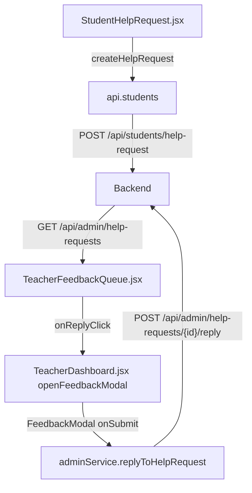

# Teacher Experience Garden Theme Integration

This document summarizes the teacher-focused garden theme overhaul completed across the CodeSage frontend and explains how the affected modules connect to each other and to backend services.

## Overview

The refresh delivers a cohesive “garden” look-and-feel across the teacher dashboard, course management, student progress tracking, and the new teacher-student feedback loop. It introduces two new components (**TeacherFeedbackQueue** and **StudentHelpRequest**) that coordinate via existing and newly added API helpers to complete the end-to-end help request workflow.

## Page-Level Changes

### `TeacherDashboard.jsx`
* Adds the shared `<Navbar />`, themed headers, and a tabbed layout composed of **My Courses**, **Forum Monitoring**, and **Feedback Queue** sections.
* Uses `PrimaryButton` everywhere for consistent actions and wraps the active tab body inside a card-styled container defined in `TeacherDashboard.css`.
* Wires the **Feedback Queue** tab to render `<TeacherFeedbackQueue />`, passing `openFeedbackModal` so teachers can reply directly from the dashboard.
* Enhances forum moderation by giving `<TeacherForumManager />` an `onReplyClick` hook that opens the shared feedback modal with forum post context.
* Controls the shared `<FeedbackModal />`, routing submissions either to `adminService.replyToHelpRequest` for help tickets or `teacherAnalyticsService.sendFeedback` for direct student messaging.

### `ManageCourse.jsx`
* Imports `<Navbar />` and applies theme-wrapped containers to the entire management experience.
* Replaces raw HTML buttons with `PrimaryButton`, choosing outline/ghost variants for secondary actions (edit, delete) while maintaining button sizing for tables and forms.
* Splits the page into card-like panels (course overview, chapter list, resource list) using the rewritten `ManageCourse.css`.

### `TeacherCourseProgress.jsx`
* Adds `<Navbar />` and imports its own `TeacherCourseProgress.css` so it no longer depends on dashboard styling.
* Styles the progress summary and detail table with the same garden palette and typography as other pages.
* Routes “Send Feedback” actions through `PrimaryButton`, which ultimately opens the shared `<FeedbackModal />` on the dashboard when combined with navigation callbacks.

### `ChapterPage.jsx`
* Introduces the **Ask for Help** tab that renders `<StudentHelpRequest chapterId={numericId} />`, extending the student experience with a garden-styled form.

## New Components

### `StudentHelpRequest.jsx`
* Collects free-form questions from students, posting them to `api.students.createHelpRequest`.
* Displays status alerts themed via `StudentHelpRequest.css`, echoing success or error states.
* Lives on the student chapter page but drives the teacher feedback loop by creating help requests that surface in the teacher dashboard.

### `TeacherFeedbackQueue.jsx`
* Fetches outstanding help requests with `adminService.getHelpRequests` and filters unresolved items.
* Presents each request inside a themed card, exposing a **Reply** `PrimaryButton` that passes structured request data to the parent via `onReplyClick`.
* When the teacher responds, the dashboard calls `adminService.replyToHelpRequest` and triggers a refresh by bumping a `refreshToken` prop.

## Shared Utilities and Styling

### `apiService.js`
Adds three helper functions used across the new workflow:
1. `api.students.createHelpRequest(chapterId, question)` – POST `/api/students/help-request`
2. `adminService.getHelpRequests()` – GET `/api/admin/help-requests`
3. `adminService.replyToHelpRequest(requestId, replyMessage)` – POST `/api/admin/help-requests/{id}/reply`

### CSS Files
* `TeacherDashboard.css` – Rewritten to theme the dashboard wrapper, cards, tables, modals, forum cards, and feedback alerts.
* `ManageCourse.css` – Provides garden-styled panels for course metadata, chapters, and resources with hover-ready list items.
* `TeacherCourseProgress.css` – Applies the themed layout and table styling for the progress report.
* `TeacherFeedbackQueue.css` – Defines the card treatment for help requests including typography for student/chapter headers.
* `StudentHelpRequest.css` – Styles the textarea form, `PrimaryButton`, and feedback alerts in the student help widget.

## End-to-End Help Request Flow

1. Students submit questions from a chapter via **StudentHelpRequest**, hitting the new student endpoint.
2. Teachers open the **Feedback Queue** tab; **TeacherFeedbackQueue** pulls pending requests and shows them as cards.
3. Clicking **Reply** opens the shared **FeedbackModal** (managed by `TeacherDashboard.jsx`) populated with context.
4. Sending a reply calls the admin endpoint to store the teacher’s response and mark the request resolved. The queue refreshes automatically.

## Forum Moderation Feedback Loop

* `<TeacherForumManager />` now accepts an `onReplyClick` prop. When a teacher selects **Reply Privately**, the dashboard reuses `<FeedbackModal />` to send targeted guidance using `teacherAnalyticsService.sendFeedback`.
* Forum deletions and course filters remain handled inside the manager while styling is provided by `TeacherDashboard.css`.

## Course Lifecycle Workflow

1. **Create Course** – The dashboard’s modal uses `teacherCourseService.createCourse`. After creation, navigation routes to `/teacher/courses/:courseId` where the themed **ManageCourse** page provides editing controls.
2. **Edit Content** – ManageCourse presents chapters/resources with outline `PrimaryButton` actions. These operations reuse existing service calls; the theme update ensures visual consistency.
3. **Monitor Progress** – The dashboard’s **View Progress** action navigates to `/teacher/course-progress/:courseId`, displaying the themed progress report defined in `TeacherCourseProgress.jsx`.

## Reuse & Accessibility Notes

* All interactive elements use `PrimaryButton` to maintain consistent focus/hover states that honor the theme variables.
* Modals and alerts now follow shared patterns (`td-modal`, `td-alert`, etc.) defined in `TeacherDashboard.css`, simplifying future enhancements.
* Each new CSS file leverages theme variables from `ThemeContext.jsx`, ensuring that future palette updates automatically cascade across the teacher tooling experience.

